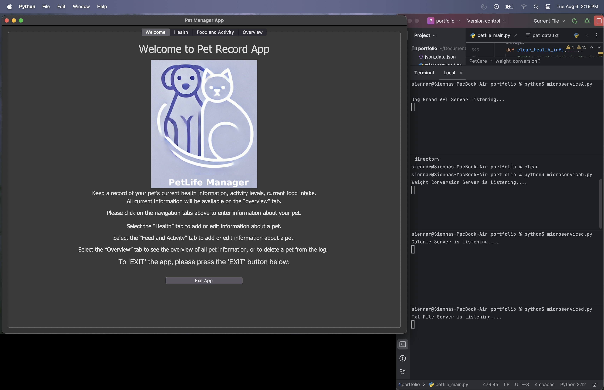

# Pet Manager App 

A desktop GUI application for managing pet-related information, including health, feeding, activity, and overview data. Built with Python and Tkinter, the app integrates with multiple microservices over ZeroMQ to provide dynamic data interaction and unit conversion.

🔐 The codebase is private. This repository serves as a project showcase with screenshots and feature descriptions.

---

 

## 🧩 Features

- 🐾 **Health Tab:** Track weight and convert units (lbs → kg/g)
- 🍖 **Feeding Tab:** Calculate recommended calories using breed and weight
- 🏃‍♂️ **Activity Tab:** Log and categorize activities using dropdowns
- 📊 **Overview Tab:** Summarize pet data and interactions
- 💬 **Microservice Architecture:** Communicates with 4 ZeroMQ microservices:
  - Breed info via external API
  - Calorie calculator
  - Weight converter
  - TXT report generator

## 🛠 Technologies Used
- Python 3.x
- Tkinter (GUI)
- ZeroMQ
- External API integration (API Ninjas)
- JSON data storage
- PIL & Pmw 

## 📫 Notes
Code is private to protect API keys and local data logic.  
Contact me for more information

---

© 2025 Sienna R.
